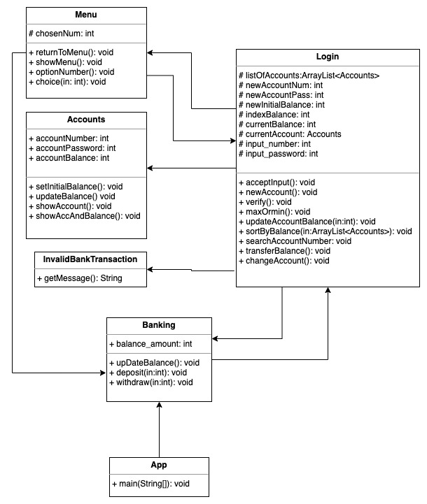

# Department-System

# Table of Contents
- [Department-System](#department-system)
- [Table of Contents](#table-of-contents)
  - [Features](#features)
  - [Concept](#concept)
    - [App Class](#app-class)
    - [Banking Class](#banking-class)
    - [Login Class](#login-class)
    - [InvalidBankTransaction Class](#invalidbanktransaction-class)
    - [Menu Class](#menu-class)
  - [UML Design](#uml-design)
  - [Run the Program](#run-the-program)
  - [Found a Bug?](#found-a-bug)
  - [Project by:](#project-by)

## Features
- Press 1 to Deposit
- Press 2 to Withdraw Amount
- Press 3 to View Balance
- Press 4 to show the max/min of an Account's balance
- Press 5 to sort and display all balance:
- Press 6 to search for an account number
- Press 7 to transfer balance to another account
- Press 8 to login to a different account
- Press any key to Exit


## Concept
Department System simulates a *bank transaction*. It allows the user to create multiple accounts. The user can log in to any of the accounts that are created. Similar to how an ATM/Mobile banking App works, it has all the features needed to perform a transaction. Users can *withdraw*, *deposit*, *check balance*, *search for a specific account*, *transfer money*, and *log into different accounts*. 

### App Class
The `App.class` is where it starts the program. It has an object of bank that calls the `initiate()` method.
### Banking Class
The `Banking.class` manages the transaction of balance. For example, `deposit` and `withdraw` methods can be found here. It stores the data to the instance variable named `int balance_amount`. The `Login.class` passes information to this class thus in the Banking constructor it has parameters that receive arguments that refer to the Login class and an int argument that updates the *balance_amount*. The `initiate()` calls `newAccount()`, `acceptInput()` and `verify()` from the `Login.class`.

*There was a bug that allows the user to deposit negative amount.* 

I fix the bug by modifying the deposit method. I add a condition that verifies if the entered amount is greater than zero or not. If the entered amount is greater than zero then it will update the current amount balance, if not it will show an error message and it will go back to the main menu options. The `withdraw method `follows the same concept.

*I created a `customize Exception class`, I'll cover this later in the documents.*
### Login Class
The `Login.class` manages account manipulation and bank transactions. It has an ArrayList of type account to store accounts that the user has created. *I added a default account, you can delete that line if you want to start with a zero account.* Account manipulation is asking the user if they want to create a new account or login to an existing one.Then it verifies it using the `verify()` method.

The other methods are `acceptInput()` to accept account number and password, the `newAccount()` is to create a new account and it is stored in the ArrayList. 

The `changeAccount()` allows the user to login to different accounts. This method calls back `acceptInput()` and `verify()`. 

The `searchAccountNumber()` displays information for a specific account number.

*Thank God for boolean flag*
I am using boolean flags throughout my code. It is one of the programming tricks that you will appreciate in your programming career. 


*So how does it work?*


You set its initial value to true or false depending on the situation. Once a certain condition is met you set its value to its opposite thus triggering another effect on your program. Here is an example on how I implement this code.
```java
boolean foundIt = false;

for(Accounts acc: listOfAccounts){
  System.out.println("Searching...");
    if(searchNum == acc.accountNumber) {
     tempAccounts = acc;
     foundIt = true;
                    
       }
}
// outside the loop
if(foundIt){
  // Do this
}
```
This is useful when you have nested for loops or in a much more complex structure.

`Try and Catch` is implemented throughout the program. This is to make sure to catch exceptions that the user could possibly encounter while keeping the program running.
### InvalidBankTransaction Class
The use of `customize exception class` is to implement customize error messages. When you use the `getMessage()` method it returns a user defined error message. This is useful because it outputs a much friendlier error message. 

The methods that are related to Bank transaction class are `maxOrmin()`, `sortByBalance()` with a parameter for an `ArrayList<Accounts>`, `transferBalance()`, and `updateAccountBalance()`. 

The `maxOrmin()` is used to display the minimum and maximum balance of all the account's stored balances. It performs a simple data structure to determine which account has maximum balance or the minimum balance.

The `sortBalance()` has two options. The user can either choose to sort all the balances of all accounts in *ascending* or *descending* order. It uses the same algorithms as the `maxOrmin()` method. It takes an arguments of an ArrayList of type Account. Remember that we created an ArrayList to hold all the accounts that the user has created. This method takes that ArrayList and makes a copy of it. It uses that copy thus making the original list unaltered.

The `transferBalance()` is a method that transfer balance between accounts. First thing it does is to verify that the chosen account exist. It does this by taking the account number and then search the ArrayList for a match, if a match is found the process continues else it will show an error. Secondly, it verifies that the current account has enough balance to do the transfer, if not it will display a message "Insufficient fund" and display the current balance amount. Thirdly, it performs two simple calculation. It takes the matched account's current balance and adds up the user entered amount to be transfer. The sum is then set as the new balance to that account. The second calculation is updating the current account balance by deducting the user input amount to the current account's balance. *Pew that is a mouthful of words*

Last method to discuss is the `updateAccountBalance()`.
```Java
public void updateAccountBalance(int amount){
        listOfAccounts.get(indexBalance).setInitialbalance(amount);
    }
```
It only does one thing, it updates the balance of current active account. This method is used inside the menu class.

*One thing we could do in this class is to refractor and take out the methods that has nothing to do with account manipulation and transfer it to the Banking class instead. Since the Banking is all about bank transactions it would be better to have these methods be implemented there.*

### Menu Class
The `Menu class` is responsible for displaying the UI. The constructor takes two arguments. A references variable for the Banking and Login class. The `showMenu()` method calls `optionNumber()` to show a list of options *(1-8 and press any key to exit)* to the user. The input data from the user is pass to the `choice()` method. The input data can be a number between 1 to 8 or any other key presses. The `choice()` method uses a switch statement to be flexible and responsive to the user command. It calls method from the Login class.

The next section will give you more idea about the relationship of each class and how they function. 


## UML Design


## Run the Program
Feel free to run the program and if you have any suggestion to make the program run smoother, I would love to know. 

## Found a Bug?
If you found a bug please report it and i will squash it!


## Project by:
Jeffrey Gropse


Thank you for checking out my project.